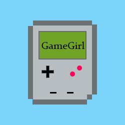
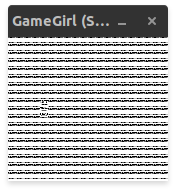
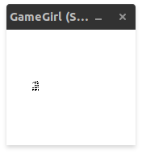
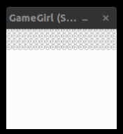
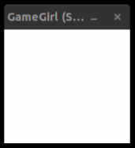
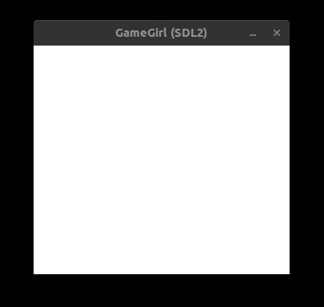
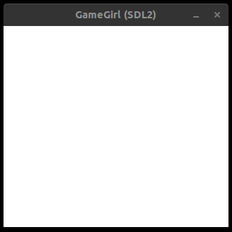

# GameGirl

  

## GameGirl is a C2X, SDL2-Driven GameBoy (DMG-01) emulator

###
46 Instructions needed to be implemented to execute DMG-01's BootROM until the end (Infinite Loop)

### BootROM Rendering Development Phases
* Multiple bugs around the source, didn't entirely grasp the draw concepts

* Multiple bugs related to offset calculation, basic LCY & WindowX understanding

* Tilemap and tiledata selection bugs, I got this pretty funny bug

* First working version of the tile mechanism, looks as expected but contains a few hacks

* Good working no-cart and cart BootROM Loading, Switched over to Texture Rendering, deprecated OpenGL DrawPixel rendering, fixed bugs in Opcode implementations

 
